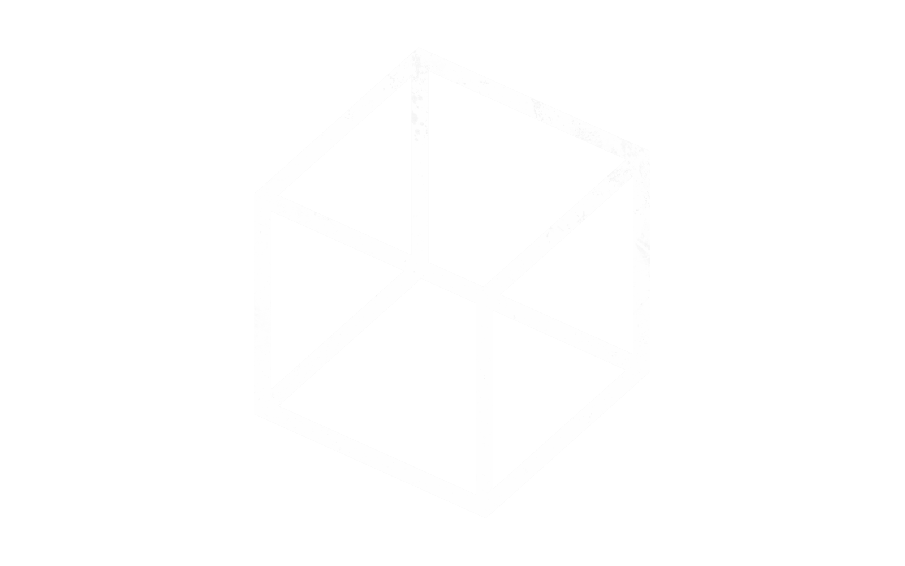

# Personal Portfolio

My personal portfolio site — built from scratch with plain HTML, CSS and a bit of JavaScript. Includes an about section, a works section (split into Software Development and Cinematography, with a little toggle to switch between them), and a contact section, all with a full EN/DE language switch.

## Features

- EN/DE language toggle with an animated text swap
- Works section split into Software Development / Cinematography, each with their own project cards
- Smooth scrolling via [Lenis](https://github.com/darkroomengineering/lenis)
- Fully responsive layout

## Tech

No build tools or frameworks — just static HTML, CSS and vanilla JavaScript.

## Running locally

Just open `index.html` in a browser, or serve the folder with any static file server (e.g. `npx serve` or the VS Code Live Server extension) if you want it running on `localhost`.

## Deployment

Deploys as a static site on [Render](https://render.com), configured via `render.yaml`.
